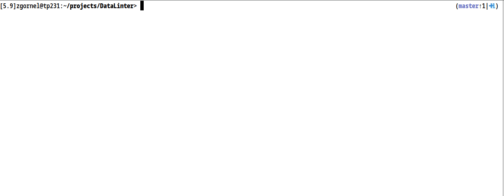

# DataLinter

Linting library and tools for machine learning, statistical modelling, data, code.

[](LICENSE.md)
[](https://github.com/zgornel/DataLinter/actions/workflows/ci.yml?query=branch%3Amaster)
[](https://codecov.io/gh/zgornel/DataLinter)
[](https://github.com/fredrikekre/Runic.jl)
[](https://zgornel.github.io/DataLinter/dev)



## Installation

The recommended way to install `DataLinter` is to download the docker image:
```
$ docker pull ghcr.io/zgornel/datalinter-compiled:latest
```

Check out the [documentation](https://zgornel.github.io/DataLinter/dev) for information on configuring, running and integrating the linters.

## Integrations

Integrations are available for [RStudio](https://github.com/zgornel/Rstudio-Addin-DataLinter) and [IPython notebooks](https://github.com/zgornel/Ipython-datalinter).

## License

This code has an GPLv3 license.


## Reporting Bugs

Please [file an issue](https://github.com/zgornel/DataLinter/issues/new) to report a bug or request a feature.


## References

[1] https://en.wikipedia.org/wiki/Lint_(software)

[2] A [data linter](https://github.com/brain-research/data-linter) written by Google

## Acknowledgements
The initial version of DataLinter was fully inspired by [this work](https://github.com/brain-research/data-linter) written by Google brain research.
