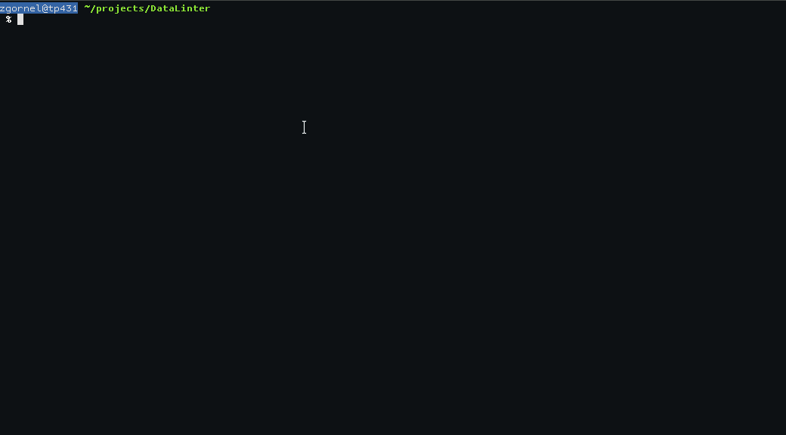

# DataLinter

A data linter written in Julia at the Vrije Universiteit Brussel.

[](https://github.com/zgornel/DataLinter/actions/workflows/ci.yml?query=branch%3Amaster)
[](LICENSE.md)
[](https://zgornel.github.io/DataLinter/dev)



## Installation

The recommended way to install `DataLinter` is to download the docker image:
```
$ docker pull ghcr.io/zgornel/datalinter-compiled:latest
```
This will download a Docker image with the compiled version of the data linter. For development, one can dowload the repository and build the Docker image separately if needed.

> Note: Before running the linter, make sure that the Docker container has mapped all the relevant directories. Check out [the Dockerfile](https://github.com/zgornel/DataLinter/blob/master/docker/Dockerfile.datalinter-compiled.alpine) of the image to see what directories are available inside the container (created with the `mkdir -p` commands).


## Running the linter
The linter comes in two flavours: as a CLI utility and as a server. Their functionality is slightly different - the CLI utility builds its linting context only from the configuration file while the server version from code that can be provided along with the data. To test them, run
```
$ docker run -it --rm \
    ghcr.io/zgornel/datalinter-compiled:latest \
        /datalinter/bin/datalinter --help
```
and
```
$ docker run -it --rm \
    ghcr.io/zgornel/datalinter-compiled:latest \
        /datalinterserver/datalinterserver --help
```
respectively.

### CLI-based linting
The CLI-based linter is useful when linting data with no context or in contexts that can be described easily with simple options i.e. type of experiment, target columns, data columns. To lint a test dataset with no context, run the following command in the root of the repository:
```
$ time docker run -it --rm \
    --volume=./test/data:/_data \
    --volume=./config:/_config \
    ghcr.io/zgornel/datalinter-compiled:latest \
        /datalinter/bin/datalinter /_data/data.csv \
            --config-path /_config/default.toml \
            --log-level warn
```

The output should look something like:
```
┌ Warning: Could not load KB@. Returning empty Dict().
└ @ DataLinter.KnowledgeBaseNative ~/.julia/packages/DataLinter/5mybQ/src/kb.jl:22
• info  (tokenizable_string)    column: x6           the values of 'column: x6' could be tokenizable i.e. contain spaces
• info  (tokenizable_string)    column: x8           the values of 'column: x8' could be tokenizable i.e. contain spaces
• info  (large_outliers)        column: x1           the values of 'column: x1' contain large outliers
! warn  (int_as_float)          column: x4           the values of 'column: x4' are floating point but can be integers
! warn  (enum_detector)         column: x5           just a few distinct values in 'column: x5', it could be an enum
! warn  (enum_detector)         column: x8           just a few distinct values in 'column: x8', it could be an enum
! warn  (enum_detector)         column: x4           just a few distinct values in 'column: x4', it could be an enum
! warn  (empty_example)         row: 10              the example at 'row: 10' looks empty
! warn  (empty_example)         row: 11              the example at 'row: 11' looks empty
! warn  (uncommon_signs)        column: x1           uncommon signs (+/-/NaN/0) present in 'column: x1'
! warn  (long_tailed_distrib)   column: x1           the distribution for 'column: x1' has 'long tails'
11 issues found from 14 linters applied (13 OK, 1 N/A) .
docker run -it --rm --volume=./test/data:/_data --volume=./config:/_config     0.02s user 0.01s system 0% cpu 4.197 total
```

The following lint uses a configuration file where the some context is provided as well:
```
$ time docker run -it --rm \
    --volume=./test/data:/_data \
    --volume=./config:/_config \
        ghcr.io/zgornel/datalinter-compiled:latest \
            /datalinter/bin/datalinter /_data/imbalanced_data.csv \
            --config-path /_config/imbalanced_data.toml \
            --log-level warn
```
which outputs,
```
! warning       (large_outliers)        column: col4         the values of 'column: col4' contain large outliers
! warning       (int_as_float)          column: col4         the values of 'column: col4' are floating point but can be integers
• info          (enum_detector)         column: col4         just a few distinct values in 'column: col4', it could be an enum
• info          (uncommon_signs)        column: col4         uncommon signs (+/-/NaN/0) present in 'column: col4'
• info          (long_tailed_distrib)   column: col4         the distribution for 'column: col4' has 'long tails'
• experimental  (imbalanced_target_variable)    dataset              Imbalanced target column in 'dataset'
6 issues found from 17 linters applied (12 OK, 5 N/A) .
docker run -it --rm --volume=./test/data:/_data --volume=./config:/_config     0.02s user 0.02s system 0% cpu 3.883 total
```

### Server-based linting
The server version of the linter is useful for integration with editors and other third party apps that can integrate outputs from a remote linter. To start the linting server and listen on address `0.0.0.0` and port `10000` one can run
```
$ docker run -it --rm -p10000:10000\
    ghcr.io/zgornel/datalinter-compiled:alpine\
        /datalinterserver/bin/datalinterserver\
            -i 0.0.0.0\
            --config-path /datalinter/config/r_glmmTMB_imbalanced_data.toml\
            --log-level debug
```
Upon starting, the server outputs:
```
 Warning: KB file not correctly specified, defaults will be used.
 └ @ datalinterserver /DataLinter/apps/datalinterserver/src/datalinterserver.jl:84
 [ Info: • Data linting server online @0.0.0.0:10000...
 [ Info: Listening on: 0.0.0.0:10000, thread id: 1
```
The server accepts HTTP requests with a specific JSON payload containing data or, data and code. Upon receiving a request, it will try to run the linter and return a JSON with the output. A client script can be found [here](./scripts/client_example.jl). The following command sets up a temporary environment for the script to run:
```
$ julia --project=@datalinter -e 'using Pkg; Pkg.add(["HTTP", "JSON", "DelimitedFiles"])'
```
Running the client script with data and code arguments
```
$ julia --project=@datalinter ./scripts/client.jl ./data/imbalanced_data.csv ./test/code/r_snippet_binomial.r
```
outputs:
```
--- Code:
path <- "./data.csv"
out1 <- loaded_data(path)
out2 <- glmmTMB(col4 ~ col1 + col2 + col3,
                data = out1,
                family = binomial(link = "linear"))  # raises linter error

--- Linting output (HTTP Status: 200):
• n/a           (imbalanced_target_variable)    dataset              linter not applicable (or failed) for 'dataset'
• experimental  (R_glmmTMB_target_variable)     dataset              Imbalanced dependent variable (glmmTMB)
• experimental  (R_glmmTMB_binomial_modelling)  dataset              Incorrect binomial data modelling (glmmTMB)
2 issues found from 3 linters applied (2 OK, 1 N/A) .
```

### Using the script
> Note: This option does not support the specification of a config file and will use the default linters and parameter values.

The linter can also be run quickly through the `datalinter.sh` shell script. To run in on the test dataset, one can do:
```
$ ./datalinter.sh ./test/data/data.csv
```
The script can be ran from any directory and accepts a single argument, the dataset that is to be linted.

## License

This code has an GPL license and therefore it is free as beer.


## Reporting Bugs

Please [file an issue](https://github.com/zgornel/DataLinter/issues/new) to report a bug or request a feature.


## References

[1] https://en.wikipedia.org/wiki/Lint_(software)

[2] A [data linter](https://github.com/brain-research/data-linter) written by Google

## Acknowledgements
The initial version of DataLinter was fully inspired by [this work](https://github.com/brain-research/data-linter) written by Google brain research.
