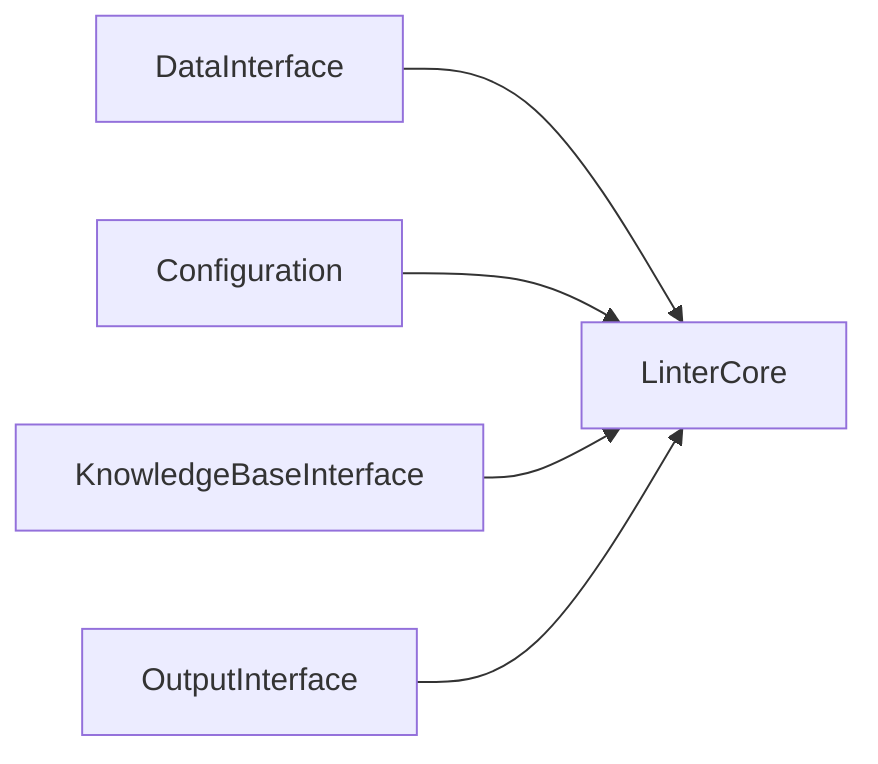

```@meta
CurrentModule=DataLinter
```

# Introduction

DataLinter is a library for contextual linting of data and code. The main idea behind the linter is that by providing additional context, more complex issues relating to data and code quality can be detected as issues in data modelling can arise due to both data structure as well as algorithmic or parameter choices. 'Context' here simply means additional information pertinent to the use of the data, available at runtime. For example, the classical way of linting a dataset is without any prior information on what the data will be used for or. Hence, the assumptions about what the data will be used for are implicit. Alternatively, one could provide, for example, the type of analysis or modelling the data is used for i.e. classification or, the code in a given programming language where the data is used. This provides a much higher degree of flexibility in the types of checks that can be implemented.

DataLinter development started by rewriting [Google's data linter project](https://github.com/brain-research/data-linter) in the Julia language. We aim for a redesign that aims at a richer and faster experience.

## Installation
There are several ways to install DataLinter: cloning the Github repository or pulling a Docker image from the [Github container registry](https://ghcr.io). Unless one wants to develop DataLinter, the Docker installation is recommended.

### Git cloning
The `DataLinter` repository can be downloaded through git:
```
$ git clone https://github.com/zgornel/DataLinter
```

### Docker image (recommended)
```
$ docker pull ghcr.io/zgornel/datalinter-compiled:latest
```

## Architecture (from [the wiki](https://github.com/zgornel/DataLinter/wiki/DataLinter-architecture))
So far the architecture looks like:

> Note:  arrows indicate dependencies and the arrow labels indicate intermediary modules
 
 - Full system: micro-kernel architecture (core system + plugins)
 ```mermaid
 graph TD
    A[data plugin module i.e. **DataCSV**] -- DataInterface --> C[Core System]
    K[knowledge plugin module i.e. **KnowledgeBaseNative**] -- KnowledgeBaseInterface --> C
    O[output plugin module] --OutputInterface --> C
```

 - `Core System`: pipeline architecture


The modules and corresponding implementations are shown below:
- [`LinterCore`](https://github.com/zgornel/DataLinter/blob/master/src/linter.jl)
- [`Configuration`](https://github.com/zgornel/DataLinter/blob/master/src/config.jl)
- [`DataInterface`](https://github.com/zgornel/DataLinter/blob/master/src/data.jl)
- [`DataCSV` (plugin)](https://github.com/zgornel/DataLinter/blob/master/src/plugins/csv.jl)
- [`KnowledgeBaseInterface`](https://github.com/zgornel/DataLinter/blob/master/src/kb.jl)
- [`KnwoledgeBaseNative` (plugin)](https://github.com/zgornel/DataLinter/blob/master/src/plugins/kb_native.jl)
- [`OutputInterface`](https://github.com/zgornel/DataLinter/blob/master/src/output.jl)
