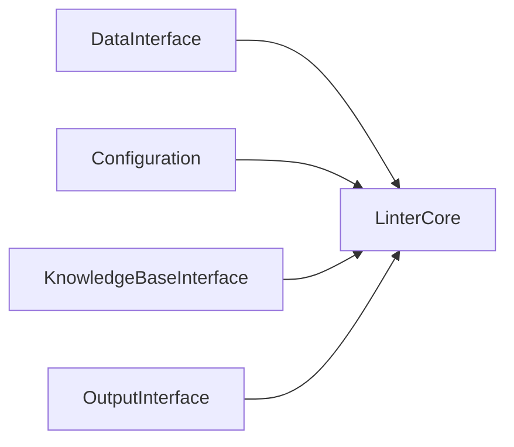

```@meta
CurrentModule=DataLinter
```

# Introduction

DataLinter is a library for contextual linting of data and code. Its main ideea is that providing additional context leads to the detection of  more complex issues relating to data and code quality. These can arise due to both data structure as well as algorithmic or parameter choices.

*Context* here simply means additional information pertinent to the use of the data, available at runtime. For example, the classical way of linting a dataset is without any prior information on what the data will be used for. Hence, the assumptions about what the data will be used for are implicit. Context in this case could be the type of analysis or modelling the data is used for i.e. classification or, the code in a given programming language which uses the data. This provides a much higher degree of flexibility in the types of checks that can be implemented.

DataLinter development started by rewriting [Google's data linter project](https://github.com/brain-research/data-linter) in the Julia language. The aim of the redesign is to provide a richer and faster experience.

## Features
Features at a glance:
 - [CSV.jl](https://github.com/JuliaData/CSV.jl) data support
 - data linters (includes original Google set)
 - [tree-sitter](https://tree-sitter.github.io/tree-sitter/)-based code parsing
 - R language linting support
 - CLI tool (`datalinter`)
 - HTTP server-client tool (`datalinterserver`)

## Installation

There are several ways to install DataLinter: cloning the Github repository or pulling a Docker image from the [Github container registry](https://ghcr.io). Unless one wants to develop DataLinter, the Docker installation is recommended which is done with
```
$ docker pull ghcr.io/zgornel/datalinter-compiled:latest
```

## Architecture (from [the wiki](https://github.com/zgornel/DataLinter/wiki/DataLinter-architecture))

The current architecture looks like:

> Note:  arrows indicate dependencies and the arrow labels indicate intermediary modules
 
 - Full system: micro-kernel architecture (core system + plugins)
 ```mermaid
 graph TD
    A[data plugin module i.e. **DataCSV**] -- DataInterface --> C[Core System]
    K[knowledge plugin module i.e. **KnowledgeBaseNative**] -- KnowledgeBaseInterface --> C
    O[output plugin module] --OutputInterface --> C
```

 - `Core System`: pipeline architecture

```mermaid
 graph LR
    D[DataInterface] --> L[LinterCore]
    C[Configuration] --> L
    K[KnowledgeBaseInterface] --> L
    O[OutputInterface]-->L
```

The modules and corresponding implementations are shown below:
- [`LinterCore`](https://github.com/zgornel/DataLinter/blob/master/src/linter.jl)
- [`Configuration`](https://github.com/zgornel/DataLinter/blob/master/src/config.jl)
- [`DataInterface`](https://github.com/zgornel/DataLinter/blob/master/src/data.jl)
- [`DataCSV` (plugin)](https://github.com/zgornel/DataLinter/blob/master/src/plugins/csv.jl)
- [`KnowledgeBaseInterface`](https://github.com/zgornel/DataLinter/blob/master/src/kb.jl)
- [`KnowledgeBaseNative` (plugin)](https://github.com/zgornel/DataLinter/blob/master/src/plugins/kb_native.jl)
- [`OutputInterface`](https://github.com/zgornel/DataLinter/blob/master/src/output.jl)
