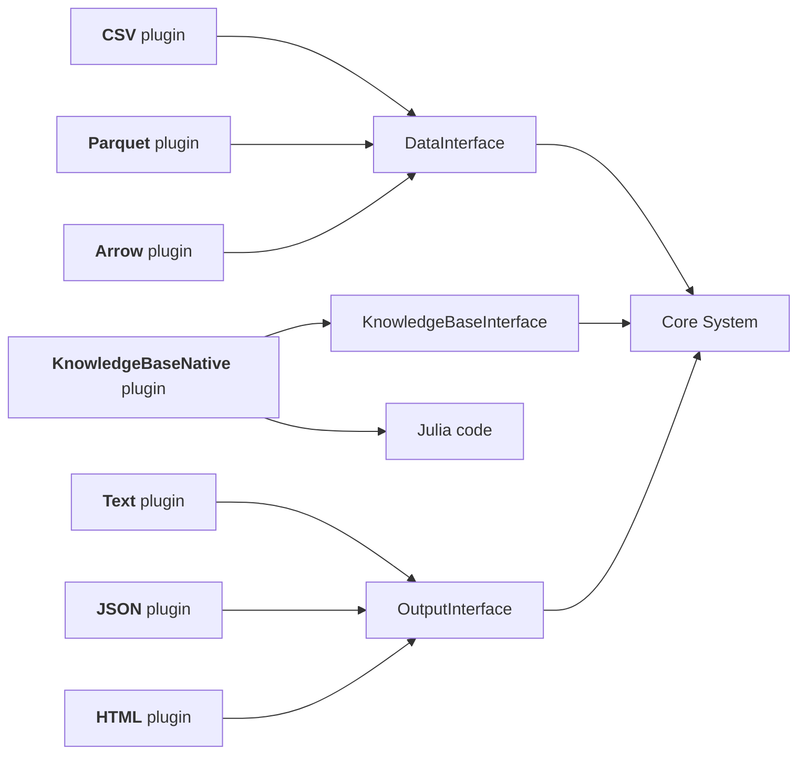
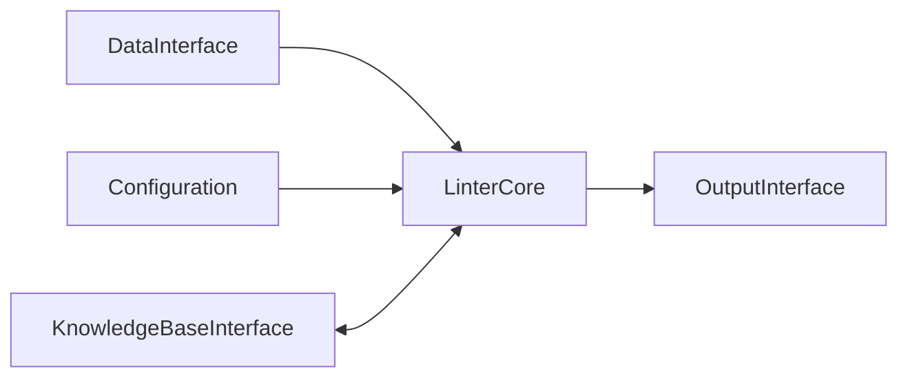

```@meta
CurrentModule=DataLinter
```

# Introduction

DataLinter is a library for contextual linting of data and code. Its development started by rewriting a [data linter](https://github.com/brain-research/data-linter) written at Google in Julia. The aim of the redesign is to provide a richer and faster experience while also providing the baseline benefits outlined in the original [paper](http://learningsys.org/nips17/assets/papers/paper_19.pdf).

Its main ideea is that providing additional context leads to the detection of  more complex issues relating to data and code quality. These can arise due to both data structure as well as algorithmic or parameter choices.

*Context* here simply means additional information pertinent to the use of the data, available at runtime. For example, the classical way of linting a dataset is without any prior information on what the data will be used for. Hence, the assumptions about what the data will be used for are implicit. Context in this case could be the type of analysis or modelling the data is used for i.e. classification or, the code in a given programming language which uses the data. This provides a much higher degree of flexibility in the types of checks that can be implemented.

## Features

Features at a glance:
- 28 [data+code linters](https://zgornel.github.io/DataLinter/dev/linters_config/) (including the [Google linters](https://github.com/brain-research/data-linter))
- Docker image with compiled binaries, production ready
- CLI and HTTP server modes with zero-config
- [CSV](https://github.com/JuliaData/CSV.jl)/[Parquet](https://parquet.apache.org/)/[Arrow](https://arrow.apache.org/) dataset support
- Text / JSON / HTML output support
- Flexible code querying through [ParSitter.jl](https://github.com/zgornel/ParSitter.jl)
- First-class R language support by [tree-sitter](https://tree-sitter.github.io/tree-sitter/)-based code parsing
- Fully customizable rule engine (see [configuration docs](https://zgornel.github.io/DataLinter/dev))

## Installation

There are several ways to install DataLinter:
 - pulling a Docker image from the [Github container registry](https://ghcr.io) (quick & safe)
 - downloading binaries (Linux only)
 - cloning the Github repository (for development of the library)

### Docker image

The latest Docker image can be downloaded with
```bash
docker pull ghcr.io/zgornel/datalinter-compiled:latest`
```

For specific versions, use
```bash
docker pull ghcr.io/zgornel/datalinter-compiled:v0.x.y`
```

Available packages (Docker images) can be viewed in the ['Packages'](https://github.com/users/zgornel/packages?repo_name=DataLinter) section of the repository's Github page.

### Binaries

The cli and server binaries (linux-x86-64) can be downloaded from the [releases](https://github.com/zgornel/DataLinter/releases) page. Each release contains an  *Assets* section with the binaries as `datalinter-compiled-binary.zip`.


### Julia

Installation can be performed also from the Julia REPL with
```julia
using Pkg; Pkg.add(url="https://github.com/zgornel/DataLinter")
```

The repository can also be directly cloned with
```bash
git clone https://github.com/zgornel/DataLinter
```


## Architecture

The diagram below shows the current architecture, found also on the [the wiki](https://github.com/zgornel/DataLinter/wiki/DataLinter-architecture).

 - The full system follows a [micro-kernel](https://en.wikipedia.org/wiki/List_of_software_architecture_styles_and_patterns#List_of_software_architecture_styles) pattern: core system + plugins (arrows indicate **dependencies**):

```mermaid
graph LR
   A1[<b>CSV</b> plugin] --> DI[DataInterface]
   DI --> C[Core System]
   A2[<b>Parquet</b> plugin] --> DI
   A3[<b>Arrow</b> plugin] --> DI
   KN[<b>KnowledgeBaseNative</b> plugin] --> KI[KnowledgeBaseInterface]
   KN --> J[Julia code]
   KI --> C
   O1[<b>Text</b> plugin] --> OI[OutputInterface]
   OI --> C
   O2[<b>JSON</b> plugin] --> OI
   O3[<b>HTML</b> plugin] --> OI
```

 - The `Core` system follows a [pipes & filters](https://en.wikipedia.org/wiki/List_of_software_architecture_styles_and_patterns#List_of_software_architecture_styles) architecture (arrows indicate **data flow**

```mermaid
graph LR
   D[DataInterface] --> L[LinterCore]
   C[Configuration] --> L
   K[KnowledgeBaseInterface] <--> L
   L --> O[OutputInterface]
```

The modules and corresponding implementations are shown below:
- [`LinterCore`](https://github.com/zgornel/DataLinter/blob/master/src/linter.jl)
- [`Configuration`](https://github.com/zgornel/DataLinter/blob/master/src/config.jl)
- [`DataInterface`](https://github.com/zgornel/DataLinter/blob/master/src/data.jl)
- [`CSV` plugin](https://github.com/zgornel/DataLinter/blob/master/src/plugins/data/csv.jl)
- [`Parquet` plugin](https://github.com/zgornel/DataLinter/blob/master/src/plugins/data/parquet.jl)
- [`Arrow` plugin](https://github.com/zgornel/DataLinter/blob/master/src/plugins/data/arrow.jl)
- [`KnowledgeBaseInterface`](https://github.com/zgornel/DataLinter/blob/master/src/kb.jl)
- [`KnowledgeBaseNative` plugin](https://github.com/zgornel/DataLinter/blob/master/src/plugins/kb/native.jl)
- [`OutputInterface`](https://github.com/zgornel/DataLinter/blob/master/src/output.jl)
- [`Text` plugin](https://github.com/zgornel/DataLinter/blob/master/src/plugins/output/text.jl)
- [`JSON` plugin](https://github.com/zgornel/DataLinter/blob/master/src/plugins/output/json.jl)
- [`HTML` plugin](https://github.com/zgornel/DataLinter/blob/master/src/plugins/output/html.jl)
- [`Julia code`](https://github.com/zgornel/DataLinter/blob/master/knowledge/native)
