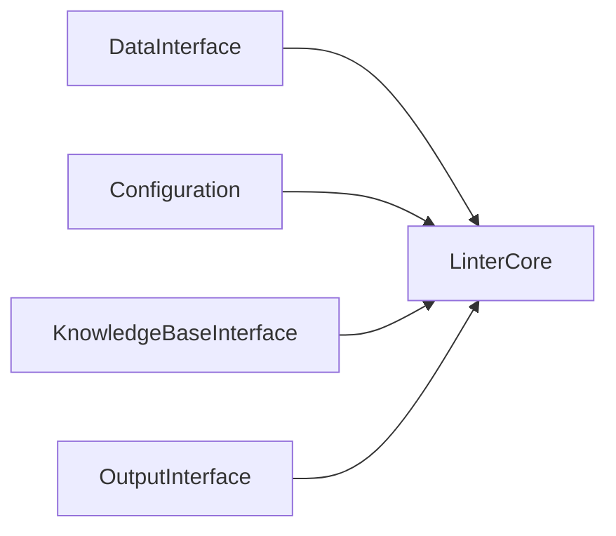

```@meta
CurrentModule=DataLinter
```

# Introduction

DataLinter is a library for contextual linting of data and code. Its development started by rewriting a [data linter](https://github.com/brain-research/data-linter) written at Google in Julia. The aim of the redesign is to provide a richer and faster experience while also providing the baseline benefits outlined in the original [paper](http://learningsys.org/nips17/assets/papers/paper_19.pdf).

Its main ideea is that providing additional context leads to the detection of  more complex issues relating to data and code quality. These can arise due to both data structure as well as algorithmic or parameter choices.

*Context* here simply means additional information pertinent to the use of the data, available at runtime. For example, the classical way of linting a dataset is without any prior information on what the data will be used for. Hence, the assumptions about what the data will be used for are implicit. Context in this case could be the type of analysis or modelling the data is used for i.e. classification or, the code in a given programming language which uses the data. This provides a much higher degree of flexibility in the types of checks that can be implemented.


## Features

Features at a glance:
 - [data+code linters](https://zgornel.github.io/DataLinter/dev/linters_config/) (including the [Google linters](https://github.com/brain-research/data-linter))
 - flexible code querying through [ParSitter.jl](https://github.com/zgornel/ParSitter.jl)
 - [CSV.jl](https://github.com/JuliaData/CSV.jl)-based data support
 - R language support by [tree-sitter](https://tree-sitter.github.io/tree-sitter/)-based code parsing
 - CLI tool ([`apps/datalinter`](https://github.com/zgornel/DataLinter/tree/master/apps/datalinter))
 - HTTP server-client tool ([`apps/datalinterserver`](https://github.com/zgornel/DataLinter/tree/master/apps/datalinterserver))

## Installation

There are several ways to install DataLinter:
 - cloning the Github repository
 - pulling a Docker image from the [Github container registry](https://ghcr.io).

Unless one wants to develop DataLinter, the Docker installation is recommended:
```
$ docker pull ghcr.io/zgornel/datalinter-compiled:latest
```

Available packages i.e. Docker images can be viewed in the ['Packages'](https://github.com/users/zgornel/packages?repo_name=DataLinter) section of the repository's Github page.

## Architecture

The diagram below shows the current architecture, found also on the [the wiki](https://github.com/zgornel/DataLinter/wiki/DataLinter-architecture).

> Note:  arrows indicate dependencies and the arrow labels indicate intermediary modules
 
 - The full system follows a [micro-kernel](https://en.wikipedia.org/wiki/List_of_software_architecture_styles_and_patterns#List_of_software_architecture_styles) pattern (core system + plugins)
 ```mermaid
 graph TD
    A[data plugin module i.e. **DataCSV**] -- DataInterface --> C[Core System]
    K[knowledge plugin module i.e. **KnowledgeBaseNative**] -- KnowledgeBaseInterface --> C
    O[output plugin module] --OutputInterface --> C
```

 - The `Core` system follows a [pipes & filters](https://en.wikipedia.org/wiki/List_of_software_architecture_styles_and_patterns#List_of_software_architecture_styles) architecture

```mermaid
 graph LR
    D[DataInterface] --> L[LinterCore]
    C[Configuration] --> L
    K[KnowledgeBaseInterface] --> L
    O[OutputInterface]-->L
```

The modules and corresponding implementations are shown below:
- [`LinterCore`](https://github.com/zgornel/DataLinter/blob/master/src/linter.jl)
- [`Configuration`](https://github.com/zgornel/DataLinter/blob/master/src/config.jl)
- [`DataInterface`](https://github.com/zgornel/DataLinter/blob/master/src/data.jl)
- [`DataCSV` (plugin)](https://github.com/zgornel/DataLinter/blob/master/src/plugins/data/csv.jl)
- [`KnowledgeBaseInterface`](https://github.com/zgornel/DataLinter/blob/master/src/kb.jl)
- [`KnowledgeBaseNative` (plugin)](https://github.com/zgornel/DataLinter/blob/master/src/plugins/kb/native.jl)
- [`OutputInterface`](https://github.com/zgornel/DataLinter/blob/master/src/output.jl)
